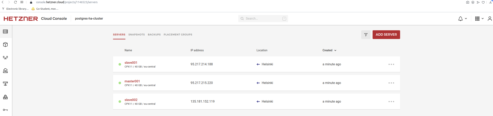

## PostgreSQL High-Availability Cluster by Patroni using ETCD cluster. CM: Automating deployment with Ansible.

- Patroni is a cluster manager used to customize and automate deployment and maintenance of PostgreSQL HA (High Availability) clusters. It uses distributed configuration stores like etcd, Consul, ZooKeeper or Kubernetes for maximum accessibility.

- etcd is a distributed reliable key-value store for the most critical data of a distributed system. etcd is written in Go and uses the Raft consensus algorithm to manage a highly-available replicated log. It is used by Patroni to store information about the status of the cluster and PostgreSQL configuration parameters.

- HAProxy is a free, very fast and reliable solution offering high availability, load balancing, and proxying for TCP and HTTP-based applications.

### Architecture overview:

Etcd three node cluster (DCS:Distributed Consensus Store):


When all the nodes are up and running:


HAProxy (OPTIONAL):


### Provision 3 Hetzner Cloud VMs with terraform for ansible testing:

```
$ git clone https://github.com/adavarski/postgres-ha; cd postgres-ha
$ cd ./infrastructure

# Setup hcloud_token

$ cat terraform.tfvars

multi_master = true
master_node_count  = 1
slave_node_count  = 2 
hcloud_token = "XXXXXXXXXXXXXXXXX" 

$ terraform init
$ terraform plan
$ terraform apply

```


### Provisioning PostgreSQL HA Cluster:

Note: The cluster is configured with a single primary and two asynchronous streaming replica.

```
### Install Ansible on control node (laptop)
$ sudo apt update && sudo apt install python3-pip sshpass git -y
$ sudo pip3 install ansible

$ cd ../postgresql_cluster
### edit ansible inventory file and run playbook

$ ansible-playbook -i ./inventory deploy_pgcluster.yml
...
PLAY RECAP ************************************************************************************************************************************************************************************************************************
135.181.152.119            : ok=95   changed=60   unreachable=0    failed=0    skipped=316  rescued=0    ignored=0   
95.217.214.188             : ok=95   changed=60   unreachable=0    failed=0    skipped=316  rescued=0    ignored=0   
95.217.215.220             : ok=105  changed=61   unreachable=0    failed=0    skipped=329  rescued=0    ignored=0   
localhost                  : ok=0    changed=0    unreachable=0    failed=0    skipped=1    rescued=0    ignored=0   

### ssh to master and check cluster:

root@master001:~# patronictl topology
+------------+-----------------+---------+---------+----+-----------+
| Member     | Host            | Role    | State   | TL | Lag in MB |
+ Cluster: postgres-cluster (7032066777905394512) -+----+-----------+
| master001  | 95.217.215.220  | Leader  | running |  1 |           |
| + slave001 | 95.217.214.188  | Replica | running |  1 |         0 |
| + slave002 | 135.181.152.119 | Replica | running |  1 |         0 |
+------------+-----------------+---------+---------+----+-----------+
root@master001:~# 

### Note: postgres user password: postgres-pass

root@master001:~# psql -h localhost -U postgres
Password for user postgres: 
psql (13.5 (Ubuntu 13.5-2.pgdg20.04+1))
SSL connection (protocol: TLSv1.3, cipher: TLS_AES_256_GCM_SHA384, bits: 256, compression: off)
Type "help" for help.

postgres=# \l
                                  List of databases
   Name    |  Owner   | Encoding |   Collate   |    Ctype    |   Access privileges   
-----------+----------+----------+-------------+-------------+-----------------------
 postgres  | postgres | UTF8     | en_US.UTF-8 | en_US.UTF-8 | 
 template0 | postgres | UTF8     | en_US.UTF-8 | en_US.UTF-8 | =c/postgres          +
           |          |          |             |             | postgres=CTc/postgres
 template1 | postgres | UTF8     | en_US.UTF-8 | en_US.UTF-8 | =c/postgres          +
           |          |          |             |             | postgres=CTc/postgres
(3 rows)

````
### HAProxy (OPTIONAL: PostgreSQL High-Availability with HAProxy Load Balancing. Note: We can use Hetzner Load Balancer also)

We need to have HAProxy to listen for connections on the PostgreSQL standard port 5432. Then HAProxy should check the patroni api to determine which node is the primary.

Example HAProxy configuration:

```
global
	maxconn 100

defaults
	log global
	mode tcp
	retries 2
	timeout client 30m
	timeout connect 4s
	timeout server 30m
	timeout check 5s

listen stats
	mode http
	bind *:7000
	stats enable
	stats uri /

listen region_one
	bind *:5432
	option httpchk
	http-check expect status 200
	default-server inter 3s fall 3 rise 2 on-marked-down shutdown-sessions
    	server patroni01 95.217.215.220:6432 maxconn 80 check port 8008
    	server patroni02 95.217.214.188:6432 maxconn 80 check port 8008
    	server patroni03 135.181.152.1192:6432 maxconn 80 check port 8008
```

Other examples with Patroni & Consul/Zookeeper (Note: OLD)

- https://github.com/adavarski/vagrant-ansible-postgresql-ha-patroni-consul (3-node cluster of PostgreSQL, managed by Patroni using Consul cluster).

- https://github.com/adavarski/vagrant-postgresql-ha-patroni-zookeeper (3-node cluster of PostgreSQL, managed by Patroni using Zookeeper cluster).
